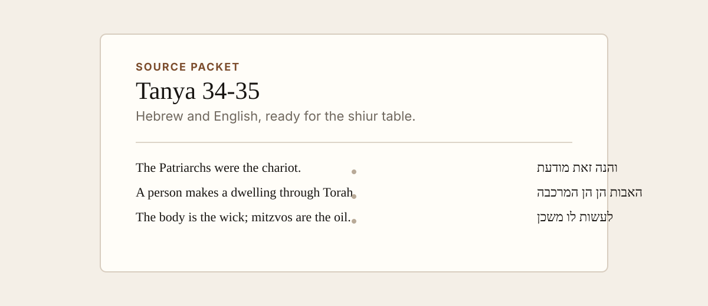

# Torah Source Packet

Create polished printable Torah source packets from Sefaria refs, paragraph
ranges, or supplied source PDFs.



This is an AgentSkill for preparing shiur handouts. It turns a source range like
`Tanya, Part I; Likkutei Amarim.34-35` into a clean bilingual packet with Hebrew
and English aligned for reading, printing, or PDF export.

The skill is deliberately modest: it does not try to teach the shiur. It helps an
agent recover the source range, keep the text faithful, and produce a tasteful
printable packet.

## When To Use It

Use this skill when someone asks for:

- a printable source sheet for a lecture or shiur
- a bilingual Hebrew/English packet from a Sefaria range
- a cleaned-up version of an attached Sefaria PDF
- a beautiful editorial PDF for a specific paragraph range
- a Torah from the Table Tanya episode that needs its discussed perakim attached
  as a source-packet PDF

## Files

- `SKILL.md` - the triggerable workflow for agents
- `references/editorial-standard.md` - typography, layout, and verification rules
- `references/source-selection.md` - how to resolve vague ranges and PDFs
- `scripts/render_torah_packet.py` - optional helper for Sefaria-backed packets
- `assets/examples/tanya-34-35.packet.json` - small public-safe example config

## Quickstart

Run the helper from the repo root:

```bash
python3 scripts/render_torah_packet.py \
  --ref "Tanya, Part I; Likkutei Amarim.34" \
  --ref "Tanya, Part I; Likkutei Amarim.35" \
  --title "Tanya 34-35: Making a Dwelling Below" \
  --subtitle "A bilingual source packet for a Tanya shiur." \
  --out out/tanya-34-35.html
```

Open the HTML in a browser and print to PDF.

If Playwright is installed, the helper can write a PDF directly:

```bash
python3 -m pip install playwright
python3 -m playwright install chromium

python3 scripts/render_torah_packet.py \
  --ref "Tanya, Part I; Likkutei Amarim.34" \
  --ref "Tanya, Part I; Likkutei Amarim.35" \
  --title "Tanya 34-35: Making a Dwelling Below" \
  --subtitle "A bilingual source packet for a Tanya shiur." \
  --out out/tanya-34-35.html \
  --pdf out/tanya-34-35.pdf
```

## Agent Workflow

1. Resolve the exact source range.
2. Fetch structured text from Sefaria when available.
3. Use supplied PDFs as visual references and range confirmation.
4. Render HTML first.
5. Export PDF from the same HTML.
6. Inspect the PDF before sending it.

For Torah from the Table Tanya shiurim, attach the rendered PDF to the episode
page beside the audio and transcript. The ingestion is incomplete until the
source packet is linked or explicitly blocked.

## Install

For Codex or OpenClaw-style skill folders, copy or symlink this repo so
`SKILL.md` is at the skill root:

```bash
mkdir -p ~/.codex/skills
ln -s /path/to/torah-source-packet-skill ~/.codex/skills/torah-source-packet
```

Use your agent platform's preferred skill installation mechanism if it has one.

## Validation

Validate the skill frontmatter:

```bash
python3 scripts/validate_skill.py
```

Smoke-test HTML rendering:

```bash
python3 scripts/render_torah_packet.py \
  --ref "Tanya, Part I; Likkutei Amarim.34" \
  --title "Smoke Test" \
  --out out/smoke.html
```

## Notes

- Source text comes from Sefaria when using the helper.
- Check translation licensing and attribution expectations before broad
  redistribution.
- Do not include private notes, phone numbers, local paths, or unpublished shiur
  materials in public examples.

## License

MIT
